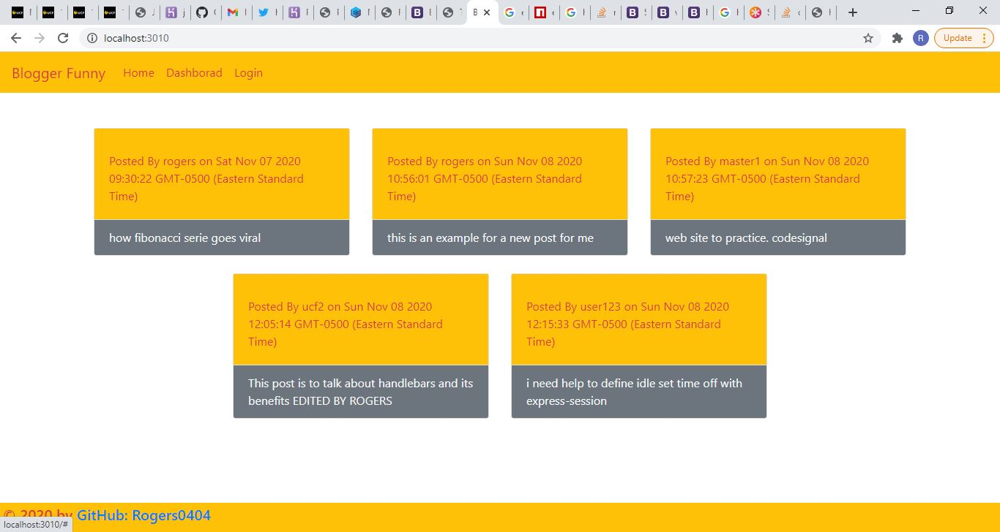
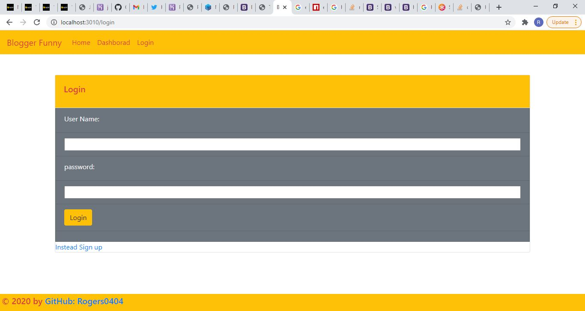
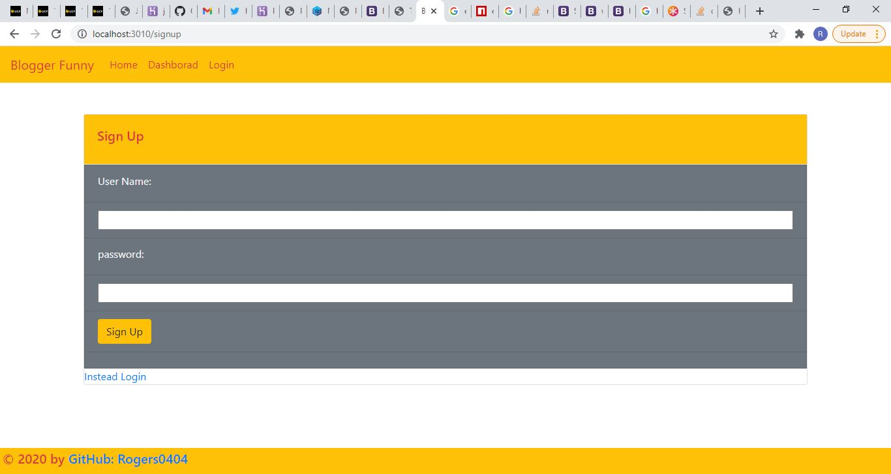
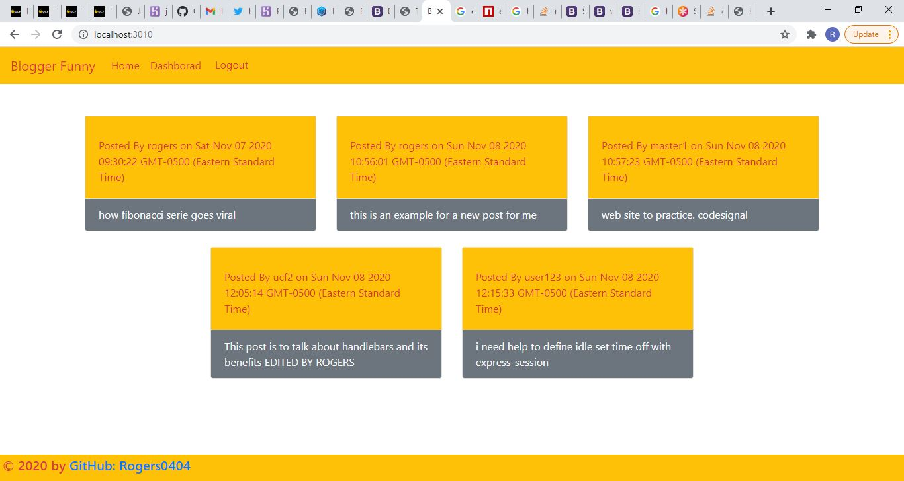
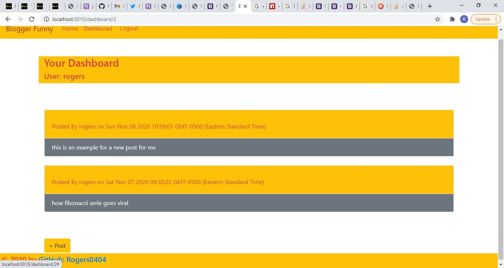
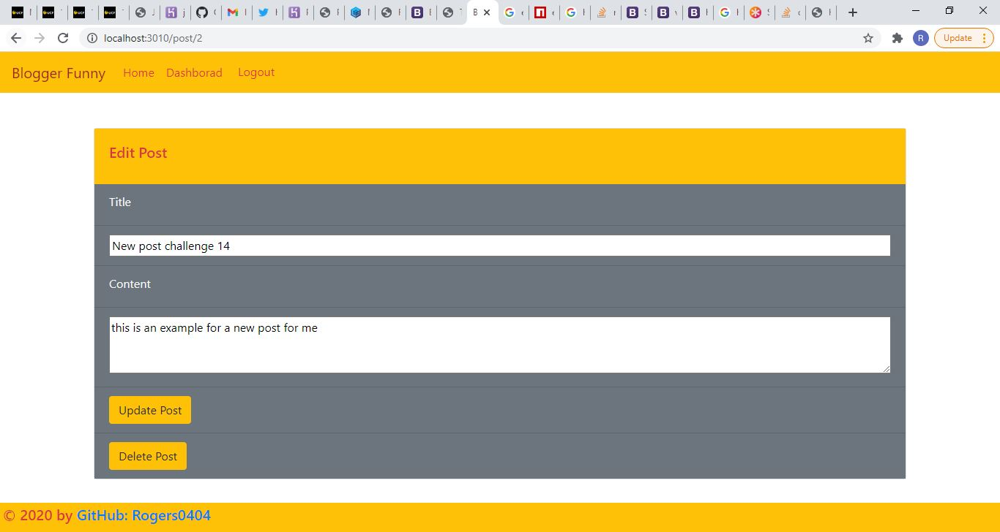

# 14-blogger-funny

## Description 

A Full Stack Web Application Blog Post that can be used to interact with other and share thoughts, opinions, etc.

You can make how many Posts you can manage, and even comment others Posts, the application allows you to create an user ann interact with other

It has developed with Express.js, MySQL Database, Sequelize, Dotenv, MySQL2,  express-session, bcrypt packages, CSS and Javascript and ES6.

## Table of Contents

* [URLs](#urls)
* [Installation](#installation)
* [Usage](#usage)
* [Contributing](#Contributing)
* [License](#license)
* [Test](#Test)
* [Questions](#questions)
* [Screenshots](#screenshots)

## URLs

* Deployed Application: 
    - [https://rogers0404.github.io/14-blogger-funny/](https://rogers0404.github.io/14-blogger-funny) (Static)
    - [https://blogger-funny.herokuapp.com/](https://blogger-funny.herokuapp.com/) (live)

* GitHub Repository:
    - [HTTPS: https://github.com/rogers0404/14-blogger-funny.git](https://github.com/rogers0404/14-blogger-funny.git)    
    - [GIT: git@github.com:rogers0404/14-blogger-funny.git](git@github.com:rogers0404/14-blogger-funny.git)

## Installation

You need some packages to run this application, 

- `git clone git@github.com:rogers0404/14-blogger-funny.git        //clone the repository`
- `npm i                                   // or npm install to get all packages and dependencies of NPM`
- `npm init                                // to get package.json`
- `npm install express                     // check wether you have installed npm packages or just install express`
- `npm install --save mysql2               // Install npm package for MySQL`
- `npm install dotenv                      // Install npm dotenv package`
- `npm install express-handlebars          // Install npm express-handlebars package`
- `npm install bcrypt                      // Install npm bcrypt package`
- `npm install express-session             // Install npm express-session package`
- `npm install connect-session-sequelize   // Install npm express-session package`
- `npm npm i sequelize                     // Install npm sequelize `
- `mysql -u root -p                        // Initial Setting to Database`
- `Inside mysql you must run the following command line. source db/schema.sql`

## Usage 

Defining Express in the application:

`const express = require('express');`
`const mysql = require('mysql2');`
`require('dotenv').config();`
`const Sequelize = require('sequelize');`
`const router = require('express').Router();`

`app.engine('handlebars', exphbs({ defaultLayout: 'main' }));`
`app.set('view engine', 'handlebars');`

`const sess = {`
  `secret: 'secret',`
  `cookie: {`
    `maxAge: 30000   // 1/2 minute of maxAge` 
  `},`
  `resave: false,`
  `saveUninitialized: false,`
  `rolling: true,     //key in true for inactivity and reset the maxAge when the server find a request in the` `time less than maxAge however the session is closed`
  `store: new SequelizeStore({`
    `db: sequelize`
  `})`
`};`

The starting command-line is:

`mysql -u root -p                          // Initial Setting to Database`
`npm start                                 // to run the server`

Examples of methods in Express.js, MySQL2, dotenv and Sequelize, express-session :

Enviroment Variables
`DB_NAME='ecommerce_db'`
`DB_USER='root'`
`DB_PW='Alejandro1210'`

Connection to DB
`sequelize.sync({ force: false }).then(() => {`  
`    app.listen(PORT, () => console.log(App listening on port ${PORT}!);`
`    });`
`});`

Routes
`router.get('/', (req, res) => {`
`    // Access our User model and run .findAll() method)`
`    User.findAll({`
`        attributes: { exclude: ['password'] }`
`      })`
`        .then(dbUserData => res.json(dbUserData))`
`        .catch(err => {`
`          console.log(err);`
`          res.status(500).json(err);`
`        });`
`  });`

## Contributing

* Rogers Ramirez, Github User: [rogers0404](http://github.com/rogers0404)

## License

blogger-funny App with Express.js is licensed under the

None

Express.js Dependency is licensed under

MIT

## Test

None

Queries are tested inside package MySQL2,

Insomnia Core for al the routes

## Questions

If you have any questions about the application, you can check the documentation on my GitHub profile [https://github.com/rogers0404](https://github.com/rogers0404).

for more information you can have a question via email [rogers.ramirez2008@gmail.com](rogers.ramirez2008@gmail.com)  .

## Screenshots

### Screenshot 1

### Screenshot 2

### Screenshot 3

### Screenshot 4

### Screenshot 5

### Screenshot 6

### Screenshot 7

